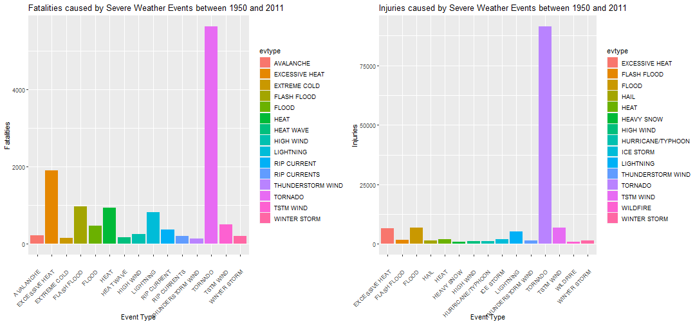
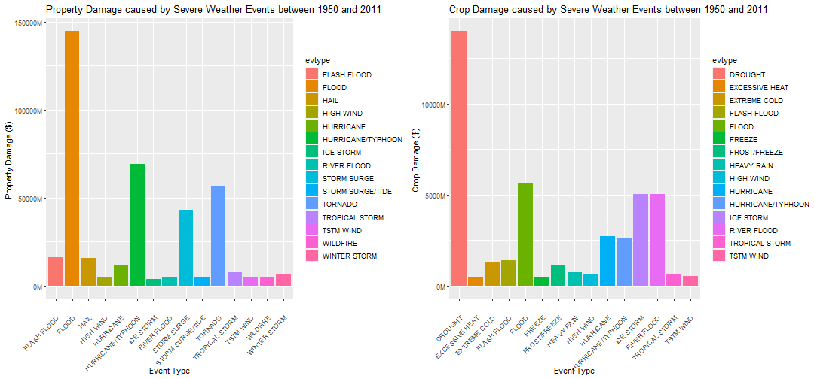

**Damages caused by Severe Weather Events between 1950 and 2011**
======================================
Author:Kunal Vaidya

## **Synopsis**
**Severe weather events** are always damaging for both population,property and crops.It is also always helpful to know which type of Severe weather event causes most damage so that Governments can prepare better to tackle the most damaging Severe weather event. The aim of this data analysis is to make use of Storm data provided by **National Oceanic and Atmospheric Administration (NOAA)** and analyze which severe weather events causes most damage in terms of population and economy in United States.The Dataset contains various Severe weather events dated from year 1950 to November 2011 and the population damage ,economic damage caused by that specific event.After analyzing the data,I found out that **Tornadoes** cause the most damage in terms of injuries and fatalities,also **Flood** causes the most property damage.

## **Data Processing**

The data comes from National Weather Service

Loading in the storm data file using read.csv().


```r
library(knitr)
storm_data <- read.csv("repdata_data_StormData.csv.bz2")
kable(head(storm_data))
```


| STATE__|BGN_DATE           |BGN_TIME |TIME_ZONE | COUNTY|COUNTYNAME |STATE |EVTYPE  | BGN_RANGE|BGN_AZI |BGN_LOCATI |END_DATE |END_TIME | COUNTY_END|COUNTYENDN | END_RANGE|END_AZI |END_LOCATI | LENGTH| WIDTH|  F| MAG| FATALITIES| INJURIES| PROPDMG|PROPDMGEXP | CROPDMG|CROPDMGEXP |WFO |STATEOFFIC |ZONENAMES | LATITUDE| LONGITUDE| LATITUDE_E| LONGITUDE_|REMARKS | REFNUM|
|-------:|:------------------|:--------|:---------|------:|:----------|:-----|:-------|---------:|:-------|:----------|:--------|:--------|----------:|:----------|---------:|:-------|:----------|------:|-----:|--:|---:|----------:|--------:|-------:|:----------|-------:|:----------|:---|:----------|:---------|--------:|---------:|----------:|----------:|:-------|------:|
|       1|4/18/1950 0:00:00  |0130     |CST       |     97|MOBILE     |AL    |TORNADO |         0|        |           |         |         |          0|NA         |         0|        |           |   14.0|   100|  3|   0|          0|       15|    25.0|K          |       0|           |    |           |          |     3040|      8812|       3051|       8806|        |      1|
|       1|4/18/1950 0:00:00  |0145     |CST       |      3|BALDWIN    |AL    |TORNADO |         0|        |           |         |         |          0|NA         |         0|        |           |    2.0|   150|  2|   0|          0|        0|     2.5|K          |       0|           |    |           |          |     3042|      8755|          0|          0|        |      2|
|       1|2/20/1951 0:00:00  |1600     |CST       |     57|FAYETTE    |AL    |TORNADO |         0|        |           |         |         |          0|NA         |         0|        |           |    0.1|   123|  2|   0|          0|        2|    25.0|K          |       0|           |    |           |          |     3340|      8742|          0|          0|        |      3|
|       1|6/8/1951 0:00:00   |0900     |CST       |     89|MADISON    |AL    |TORNADO |         0|        |           |         |         |          0|NA         |         0|        |           |    0.0|   100|  2|   0|          0|        2|     2.5|K          |       0|           |    |           |          |     3458|      8626|          0|          0|        |      4|
|       1|11/15/1951 0:00:00 |1500     |CST       |     43|CULLMAN    |AL    |TORNADO |         0|        |           |         |         |          0|NA         |         0|        |           |    0.0|   150|  2|   0|          0|        2|     2.5|K          |       0|           |    |           |          |     3412|      8642|          0|          0|        |      5|
|       1|11/15/1951 0:00:00 |2000     |CST       |     77|LAUDERDALE |AL    |TORNADO |         0|        |           |         |         |          0|NA         |         0|        |           |    1.5|   177|  2|   0|          0|        6|     2.5|K          |       0|           |    |           |          |     3450|      8748|          0|          0|        |      6|
Now,in the following step I cumulated the fatalities and injuries for each event because there are multiple occurrences of events at different location or time

## **Population Health**
Analyzing the data for population health 
Calculating cumulative number of fatalities and injuries for each unique event.Using only top 15 most damaging events for visualization

```r
fatalities <- with(storm_data,tapply(FATALITIES,EVTYPE,sum))
evtype <- unique(storm_data$EVTYPE)
o <- order(evtype)
evtype <- evtype[o]
fatal.data <- data.frame(evtype=evtype,Fatalities=fatalities)

library(plyr)
fatal.data <- arrange(fatal.data,desc(fatal.data$Fatalities))
fatal.top <- fatal.data[1:15,]
injury <- with(storm_data,tapply(INJURIES,EVTYPE,sum))
injury.data <- data.frame(evtype=evtype,Injuries=injury)
injury.data <-arrange(injury.data,desc(injury.data$Injuries))
injury.top <- injury.data[1:15,]
library(knitr)

kable(list(fatal.top,injury.top))
```


|evtype            | Fatalities|
|:-----------------|----------:|
|TORNADO           |       5633|
|EXCESSIVE HEAT    |       1903|
|FLASH FLOOD       |        978|
|HEAT              |        937|
|LIGHTNING         |        816|
|TSTM WIND         |        504|
|FLOOD             |        470|
|RIP CURRENT       |        368|
|HIGH WIND         |        248|
|AVALANCHE         |        224|
|WINTER STORM      |        206|
|RIP CURRENTS      |        204|
|HEAT WAVE         |        172|
|EXTREME COLD      |        160|
|THUNDERSTORM WIND |        133|

|evtype            | Injuries|
|:-----------------|--------:|
|TORNADO           |    91346|
|TSTM WIND         |     6957|
|FLOOD             |     6789|
|EXCESSIVE HEAT    |     6525|
|LIGHTNING         |     5230|
|HEAT              |     2100|
|ICE STORM         |     1975|
|FLASH FLOOD       |     1777|
|THUNDERSTORM WIND |     1488|
|HAIL              |     1361|
|WINTER STORM      |     1321|
|HURRICANE/TYPHOON |     1275|
|HIGH WIND         |     1137|
|HEAVY SNOW        |     1021|
|WILDFIRE          |      911|
                 
                          Table Showing number of fatalities and injuries for 15 most damaging events

## **Economic Damages**

### **Property Damages**

Removing all property damages having zero value as they are not of use and also removing all NA's

```r
zeros_prop <- !storm_data$PROPDMG==0
storm.clean.prop <- storm_data[zeros_prop,]
na <- !is.na(storm.clean.prop$PROPDMGEXP)
storm.clean.prop <- storm.clean.prop[na,]
na <- !is.na(storm.clean.prop$PROPDMGE)
storm.clean.prop <- storm.clean.prop[na,]
```

As in dataset property damages is divided in two parts PROPDMG gives numeric value and PROPDMGEXP gives unit.
There are four units  
1)"H":Hundred  
2)"K":Thousand  
3)"M":Million  
4)"B":Billion  
Substituting Hundreds,Thousand etc. with their numeric values

```r
storm.clean.prop$PROPDMGEXP <- gsub("[Hh]","100",storm.clean.prop$PROPDMGEXP)
storm.clean.prop$PROPDMGEXP <- gsub("[Kk]","1000",storm.clean.prop$PROPDMGEXP)
storm.clean.prop$PROPDMGEXP <- gsub("[Mm]","1000000",storm.clean.prop$PROPDMGEXP)
storm.clean.prop$PROPDMGEXP <- gsub("[Bb]","1000000000",storm.clean.prop$PROPDMGEXP)

storm.clean.prop$PROPDMGECL <- storm.clean.prop$PROPDMG * as.numeric(storm.clean.prop$PROPDMGEXP)
```

```
## Warning: NAs introduced by coercion
```

```r
na <- !(is.na(storm.clean.prop$PROPDMGECL))
storm.clean.prop <- storm.clean.prop[na,]
prop_damage <- with(storm.clean.prop,tapply(PROPDMGECL,EVTYPE,sum))
evtype.cl <- unique(storm.clean.prop$EVTYPE)

o.cl <- order(evtype.cl)
evtype.cl <- evtype.cl[o.cl]
```

Creating a dataframe for property damages in dollars and the event type


```r
prop.damage.data <- data.frame(evtype=evtype.cl,prop_damage=prop_damage)
library(plyr)

prop.damage.data <- arrange(prop.damage.data,desc(prop.damage.data$prop_damage))

kable(prop.damage.data[1:15,])
```


|evtype            |  prop_damage|
|:-----------------|------------:|
|FLOOD             | 144657709800|
|HURRICANE/TYPHOON |  69305840000|
|TORNADO           |  56937160991|
|STORM SURGE       |  43323536000|
|FLASH FLOOD       |  16140812087|
|HAIL              |  15732267370|
|HURRICANE         |  11868319010|
|TROPICAL STORM    |   7703890550|
|WINTER STORM      |   6688497250|
|HIGH WIND         |   5270046260|
|RIVER FLOOD       |   5118945500|
|WILDFIRE          |   4765114000|
|STORM SURGE/TIDE  |   4641188000|
|TSTM WIND         |   4484928440|
|ICE STORM         |   3944927810|

                                      Table for Property Damages in Dollars for top 15 events

### **Crop Damages**
Doing the same steps as did for Property Damages

```r
zeros_crop <- !storm_data$CROPDMG==0
storm.clean.crop <- storm_data[zeros_crop,]
na <- !is.na(storm.clean.crop$CROPDMGEXP)
storm.clean.crop <- storm.clean.crop[na,]
storm.clean.crop$CROPDMGEXP <- gsub("[Hh]","100",storm.clean.crop$CROPDMGEXP)
storm.clean.crop$CROPDMGEXP <- gsub("[Kk]","1000",storm.clean.crop$CROPDMGEXP)
storm.clean.crop$CROPDMGEXP <- gsub("[Mm]","1000000",storm.clean.crop$CROPDMGEXP)
storm.clean.crop$CROPDMGEXP <- gsub("[Bb]","1000000000",storm.clean.crop$CROPDMGEXP)

storm.clean.crop$CROPDMGECL <- storm.clean.crop$CROPDMG * as.numeric(storm.clean.crop$CROPDMGEXP)
crop_damage <- with(storm.clean.crop,tapply(CROPDMGECL,EVTYPE,sum))
evtype.cl <- unique(storm.clean.crop$EVTYPE)
o.cl <- order(evtype.cl)
evtype.cl <- evtype.cl[o.cl]
crop.damage.data <- data.frame(evtype=evtype.cl,crop_damage=crop_damage)
library(plyr)
crop.damage.data <- arrange(crop.damage.data,desc(crop.damage.data$crop_damage))

kable(crop.damage.data[1:15,])
```


|evtype            | crop_damage|
|:-----------------|-----------:|
|DROUGHT           | 13972566000|
|FLOOD             |  5661968450|
|RIVER FLOOD       |  5029459000|
|ICE STORM         |  5022113500|
|HURRICANE         |  2741910000|
|HURRICANE/TYPHOON |  2607872800|
|FLASH FLOOD       |  1421317100|
|EXTREME COLD      |  1292973000|
|FROST/FREEZE      |  1094086000|
|HEAVY RAIN        |   733399800|
|TROPICAL STORM    |   678346000|
|HIGH WIND         |   638571300|
|TSTM WIND         |   554007350|
|EXCESSIVE HEAT    |   492402000|
|FREEZE            |   446225000|

                                       Table for Property Damages in Dollars for top 15 events

## **Results**
### **Population Health Damages**


```r
library(ggplot2)
library(ggpubr)
options(scipen=999)
```
To show which event is most damaging a bar plot would be most appropriate to show which event has most injuries or fatalities.  


As from plot it is clear that **Tornadoes** are the most damaging in terms of both injuries and fatalities.  
Second most fatal event is **Excessive Heat**.

```r
plot1 <- ggplot(data=fatal.top,aes(x=evtype,y=Fatalities)) + geom_bar(stat='identity',aes(fill=evtype)) + theme(axis.text.x =element_text(angle=45,vjust=0.8,hjust=1)) + xlab("Event Type") +  ggtitle("Fatalities caused by Severe Weather Events between 1950 and 2011")
plot2 <- ggplot(data=injury.top,aes(x=evtype,y=Injuries)) + geom_bar(stat='identity',aes(fill=evtype)) +  theme(axis.text.x =element_text(angle=45,vjust=0.8,hjust=1)) + xlab("Event Type") +  ggtitle("Injuries caused by Severe Weather Events between 1950 and 2011")
ggarrange(plot1,plot2)
```


          
                           Bar Plot showing Fatalities and Injuries for the top 15 most damaging events
     
### **Property and Crop Damages**
Again barplot will be the most appropriate

As from plot it is clear that **Floods** has caused most damage to property.Second most damaging is **Hurricane/Typhoon**.
For crop damages the most damaging is **Drought** and Second is **Freeze**.  

**M** in y-axis stands for Million

```r
plot3 <- ggplot(data=prop.damage.data[1:15,],aes(x=evtype,y=prop_damage)) + geom_bar(stat='identity',aes(fill=evtype)) + theme(axis.text.x =element_text(angle=45,vjust=0.8,hjust=1)) + ylab("Property Damage ($) ") + xlab('Event Type') + scale_y_continuous(labels=function(x){paste0(x/1000000,"M")}) + ggtitle("Property Damage caused by Severe Weather Events between 1950 and 2011")
plot4 <- ggplot(data=crop.damage.data[1:15,],aes(x=evtype,y=crop_damage)) + geom_bar(stat='identity',aes(fill=evtype)) + theme(axis.text.x =element_text(angle=45,vjust=0.8,hjust=1)) + ylab("Crop Damage ($) ") + xlab('Event Type') + scale_y_continuous(labels=function(x){paste0(x/1000000,"M")}) +  ggtitle("Crop Damage caused by Severe Weather Events between 1950 and 2011")
ggarrange(plot3,plot4)
```



                Bar plot showing Property Damages and Crop Damages (both in dollars) for top 15 most damaging events
